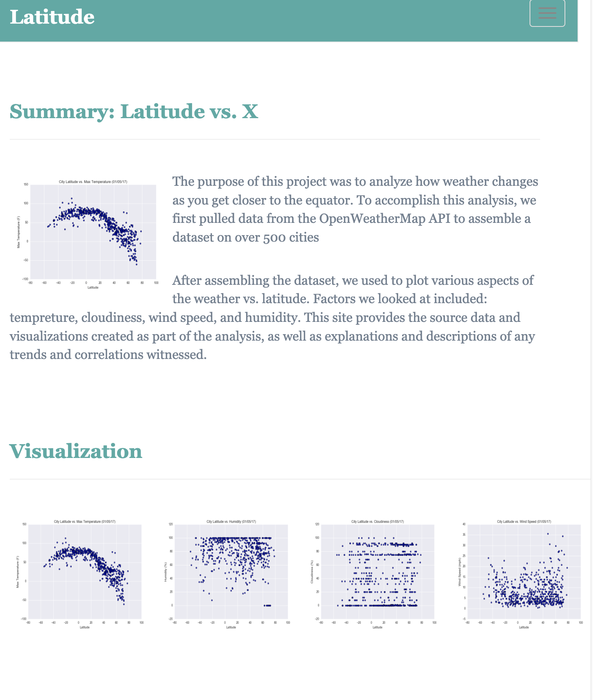

# Web Design Challenge
Bs
- Created a website by using visualizations in the images folder which were results of a previous challenge (Python-APIs Challenge).

- Created individual pages for each plot (Temp, Humidity, Cloudiness, and WindSpeed) and each one of these pages includes visualizations.

- Build a comparison page for all the plots.

- Build another page to show the data that we used to create the plots.

### Website Requirements

The website has seven pages:

- A [landing page](#landing-page) containing:

  - Section-1: Summary of the project.

  - Section-2: Visualizations page. by clicking an image in the visualizations section should you to that visualization.

- A ["Comparisons" page](#comparisons-page) containing:

  - The visualizations all together so we can easily compare them together.

- A ["Data" page](#data-page) containing:

  - Table with the data used in the visualizations.

- A ["Temp" page](#temp-page) containing:

  - Clear visualization for the temp vs latitude with description.

- A ["Humidity" page](#temp-page) containing:

  - Clear visualization for the Humidity vs latitude with description.

- A ["Cloudiness" page](#temp-page) containing:

  - Clear visualization for the temp vs latitude with description.

- A ["Wind" page](#temp-page) containing:

  - Clear visualization for the temp vs latitude with description.

#### Landing page

Large screen:

Small screen:



#### Comparisons page

Large screen:

Small screen:

#### Data page

Large screen:

Small screen:

#### Visualization pages

Large screen:

Small screen:

